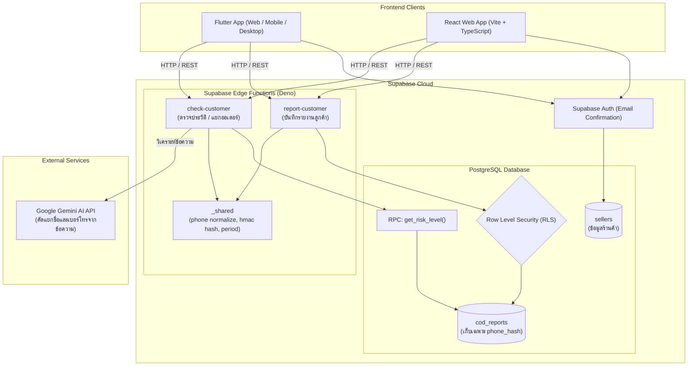

# 📦 COD Customer Check (ระบบตรวจสอบประวัติลูกค้า COD)

[](https://3towson.github.io/low-code/)
[](https://flutter.dev)
[](https://react.dev)
[](https://supabase.com)
[](https://ai.google.dev)
[](https://www.typescriptlang.org)

> **เว็บแอปพลิเคชันสำหรับร้านค้าออนไลน์รายย่อย เพื่อใช้ตรวจสอบความเสี่ยงของลูกค้าปลายทาง (Cash on Delivery: COD) และแจ้งเตือนประวัติการปฏิเสธรับสินค้าหรือพัสดุตีกลับ ช่วยลดต้นทุนค่าส่งและป้องกันความเสียหายจากการส่งของ**

🌐 **ทดลองใช้งานจริง (Live Demo):** [https://3towson.github.io/low-code/](https://3towson.github.io/low-code/)

---

## 📑 สารบัญ
- [✨ ฟีเจอร์หลัก (Key Features)](#-ฟีเจอร์หลัก-key-features)
- [🚦 เกณฑ์การประเมินระดับความเสี่ยง (Risk Assessment)](#-เกณฑ์การประเมินระดับความเสี่ยง-risk-assessment)
- [🛡️ ความปลอดภัยและความเป็นส่วนตัว (Privacy & Security)](#️-ความปลอดภัยและความเป็นส่วนตัว-privacy--security)
- [🏗️ สถาปัตยกรรมระบบ (System Architecture)](#️-สถาปัตยกรรมระบบ-system-architecture)
- [📁 โครงสร้างโปรเจกต์ (Project Structure)](#-โครงสร้างโปรเจกต์-project-structure)
- [🚀 การติดตั้งและเริ่มต้นใช้งาน (Getting Started)](#-การติดตั้งและเริ่มต้นใช้งาน-getting-started)
  - [1. การตั้งค่า Environment Variables](#1-การตั้งค่า-environment-variables)
  - [2. การรัน Flutter App (Web/Desktop/Mobile)](#2-การรัน-flutter-app)
  - [3. การรัน React Web App](#3-การรัน-react-web-app)
  - [4. การรันสคริปต์ทดสอบและ Edge Functions](#4-การรันสคริปต์ทดสอบและ-edge-functions)
- [🧪 การทดสอบและผลลัพธ์ (Testing & QA)](#-การทดสอบและผลลัพธ์-testing--qa)
- [🚢 การ Deploy ขึ้น GitHub Pages](#-การ-deploy-ขึ้น-github-pages)

---

## ✨ ฟีเจอร์หลัก (Key Features)

1. **ตรวจสอบความเสี่ยงลูกค้าได้ทันที (Customer Risk Check)**
   - รองรับการกรอกเบอร์โทรโดยตรง หรือวางข้อความออเดอร์ดิบ (Raw Order Text) จากแชท
   - **Smart Order Parser & AI Extract**: ตัดแบ่งหลายออเดอร์อัตโนมัติ (Multi-order Splitting) และสกัดชื่อ-เบอร์โทรด้วย **Google Gemini AI** พร้อมระบบ Fallback ด้วย Regular Expression อัตโนมัติ
   - แสดงระดับความเสี่ยง (เขียว / เหลือง / แดง), จำนวนครั้งที่เคยถูกรายงาน และช่วงเวลาที่ถูกรายงานล่าสุด
   - ใช้งานหน้าตรวจสอบได้ทันทีโดยไม่ต้องเข้าสู่ระบบ (Guest Mode)

2. **ระบบรายงานลูกค้าที่มีปัญหา (Problematic Customer Reporting)**
   - ฟอร์มรายงานระบุ: ชื่อ, เบอร์โทร, แพลตฟอร์ม, สาเหตุ, มูลค่าความเสียหาย (Damage Amount), และรายละเอียดเพิ่มเติม
   - รองรับตัวเลือก "อื่นๆ" (Other) พร้อมช่องกรอกเพิ่มเติมแบบไดนามิก
   - ระบบป้องกันสแปมและการส่งรายงานซ้ำ (Anti-duplicate Reports) ภายใน 7 วันจากร้านเดิม
   - บังคับเข้าสู่ระบบผ่าน Supabase Auth เพื่อยืนยันตัวตนร้านค้าก่อนส่งรายงาน

3. **ดีไซน์สวยงาม ทันสมัย รองรับ 2 ภาษา (Bilingual & Multi-Theme)**
   - สลับโหมดการแสดงผล **Dark Mode / Light Mode** ได้อย่างลื่นไหล
   - สลับภาษาได้ทันที: **ภาษาไทย (TH)** และ **English (EN)**
   - ออกแบบ UI ตามมาตรฐาน Material 3 & Modern Glassmorphism Responsive Design

4. **มี 2 รูปแบบ Frontend ให้เลือกใช้งาน**
   - **Flutter App (`app/`)**: ประสิทธิภาพสูง รองรับทั้ง Web, Android, iOS, Windows
   - **React App (`web/`)**: พัฒนาด้วย React 19 + Vite + TypeScript พร้อมไอคอน Lucide

---

## 🚦 เกณฑ์การประเมินระดับความเสี่ยง (Risk Assessment)

ระบบคำนวณความเสี่ยงด้วย PostgreSQL Function (`get_risk_level`) บนฐานข้อมูล Supabase ตามเงื่อนไขดังนี้:

| ระดับความเสี่ยง | เงื่อนไขการคำนวณ | คำแนะนำที่แสดงผลแก่ร้านค้า |
| :---: | :--- | :--- |
|  **สีเขียว (Green)** | ไม่มีประวัติรายงานที่นับ (รายงานที่สถานะ `active` ภายใน 12 เดือน) | **"ส่งได้ตามปกติ"** |
|  **สีเหลือง (Yellow)** | มีรายงานที่นับอย่างน้อย 1 ครั้ง แต่ยังไม่เข้าเกณฑ์สีแดง | **"ควรโทรหรือทักยืนยันออเดอร์กับลูกค้าก่อนแพ็กสินค้า"** |
|  **สีแดง (Red)** | มีรายงานภายใน 90 วันจากร้านค้าต่างกันตั้งแต่ **2 ร้านขึ้นไป** โดยร้านค้าที่รายงานต้องมีอายุบัญชีอย่างน้อย 7 วัน | **"ไม่แนะนำให้ส่งแบบเก็บเงินปลายทาง ควรให้ลูกค้าโอนชำระก่อน"** |

### สาเหตุการรายงานที่รองรับ (Reasons)
- `refused_delivery`: ปฏิเสธรับสินค้า / พัสดุตีกลับ
- `unreachable`: ติดต่อไม่ได้ / ปิดเครื่อง / บล็อกเบอร์
- `fake_address`: ที่อยู่ปลอมหรือไม่ถูกต้อง
- `other`: อื่นๆ (ระบุรายละเอียดเพิ่มเติมได้)

### แพลตฟอร์มที่รองรับ (Platforms)
- Shopee, Lazada, TikTok, Facebook, LINE, Other (อื่นๆ)

---

## 🛡️ ความปลอดภัยและความเป็นส่วนตัว (Privacy & Security)

เพื่อให้สอดคล้องกับมาตรฐานความปลอดภัยและ พ.ร.บ. คุ้มครองข้อมูลส่วนบุคคล (PDPA):

1. **ไม่บันทึกเบอร์โทรศัพท์จริงลง Database โดยเด็ดขาด**:
   - เบอร์โทรศัพท์จะถูกนำเข้าสู่กระบวนการ **Normalize** (แปลงเลขไทยเป็นอารบิก, จัดการรหัสประเทศ `+66` หรือ `66` ให้เป็น `0`, ตรวจสอบ regex `^0[689]\d{8}$`)
   - นำเบอร์ที่ Normalize แล้วมาผ่านการเข้ารหัส **HMAC-SHA256** ด้วย `PHONE_HASH_SECRET` เพื่อสร้าง `phone_hash` (ความยาว 64 ตัวอักษร)
   - กระบวนการ Hash ทำงานบน **Supabase Edge Function** เท่านั้น โค้ดฝั่ง Client ไม่มี Secret Key
2. **การซ่อนเบอร์โทร (Phone Masking)**:
   - ข้อมูลเบอร์โทรที่ส่งกลับไปยังหน้าบ้านจะแสดงผลในรูปแบบ Mask เสมอ เช่น `081-XXX-5678`
3. **การปกป้องความเป็นส่วนตัวของร้านค้าและลูกค้า**:
   - ไม่มีการเปิดเผยว่าร้านค้าใดเป็นผู้รายงาน
   - ไม่ส่งชื่อหรือข้อมูลส่วนบุคคลที่ร้านอื่นกรอกกลับไปยังร้านค้าอื่น
   - มีการตั้งค่า **Row Level Security (RLS)** บล็อกไม่ให้ Client สามารถ Query ตาราง `cod_reports` ได้โดยตรง ทุกการอ่าน-เขียนต้องผ่าน Edge Functions ที่ตรวจสอบสิทธิ์แล้วเท่านั้น

---

## 🏗️ สถาปัตยกรรมระบบ (System Architecture)



---

## 📁 โครงสร้างโปรเจกต์ (Project Structure)

```text
├── app/                          # 📱 Flutter Application
│   ├── lib/
│   │   ├── localization/         # ระบบ 2 ภาษา (Thai / English)
│   │   ├── pages/                # หน้าจอ: Home, Login, Check, Report
│   │   ├── services/             # เชื่อมต่อ Supabase & Edge Functions
│   │   ├── utils/                # Order Splitter, Formats
│   │   ├── widgets/              # CheckPanel, RiskCard, SettingsDialog
│   │   ├── theme.dart            # Modern Light & Dark Theme Data
│   │   └── main.dart             # จุดเริ่มต้นโปรแกรม
│   ├── test/                     # Unit & Widget Tests (>140 tests)
│   └── web/                      # Flutter Web Config & Shell
│
├── web/                          # ⚛️ React 19 + Vite Application
│   ├── src/
│   │   ├── components/           # Navbar, CheckPanel, RiskCard, ReportModal, AuthModal
│   │   ├── context/              # AppContext (Auth, Theme, Language State)
│   │   ├── services/             # Supabase Client & API calls
│   │   └── index.css             # Glassmorphic & Modern Styling
│   └── vite.config.ts
│
├── supabase/                     # ⚡ Supabase Backend
│   ├── migrations/               # SQL Migrations (Schemas, RLS, Triggers, RPC)
│   └── functions/                # Deno Edge Functions
│       ├── _shared/              # Phone Normalizer, Hasher, Period calculator
│       ├── check-customer/       # Function ตรวจสอบประวัติลูกค้า
│       └── report-customer/      # Function บันทึกรายงานพฤติกรรม
│
├── scripts/                      # 🛠️ สคริปต์ Deno & Deployment
│   ├── check_setup.ts            # ตรวจสอบการเชื่อมต่อ Supabase & Gemini
│   ├── seed_demo.ts              # สคริปต์สร้างข้อมูลจำลองสำหรับการสาธิต
│   ├── test_part1.ts - 7.ts      # สคริปต์ Automated Test แต่ละส่วน
│   ├── e2e_test.ts               # End-to-End Test ครบวงจร
│   └── deploy_web.ps1            # สคริปต์สร้างและ Deploy Flutter Web ไปยัง GitHub Pages
│
├── docs/                         # 📚 เอกสารประกอบ
│   ├── PROJECT_CONTEXT.md        # ข้อกำหนดและขอบเขตโปรเจกต์
│   ├── TEST_REPORT.md            # รายงานผลการทดสอบทั้งหมด (194 tests)
│   └── manual_test_part*.md      # แผนการทดสอบด้วยมือ (Manual Test Checklist)
│
└── tests/fixtures/               # ข้อมูลตัวอย่างสำหรับรันทดสอบ
```

---

## 🚀 การติดตั้งและเริ่มต้นใช้งาน (Getting Started)

### ข้อกำหนดเบื้องต้น (Prerequisites)
- [Git](https://git-scm.com/)
- [Flutter SDK](https://flutter.dev/docs/get-started/install) (3.13 ขึ้นไป)
- [Node.js](https://nodejs.org/) (v18+) และ npm
- [Deno](https://deno.land/) (สำหรับการรันสคริปต์ทดสอบและ Edge Functions)
- บัญชี [Supabase](https://supabase.com/) และ [Google AI Studio](https://aistudio.google.com/)

---

### 1. การตั้งค่า Environment Variables

คัดลอกไฟล์ตัวอย่าง `.env.example` เป็น `.env` ใน Root Directory:

```bash
cp .env.example .env
```

กรอกข้อมูลสำคัญใน `.env`:
```env
SUPABASE_PROJECT_REF=your_supabase_project_ref
SUPABASE_URL=https://your-project.supabase.co
SUPABASE_ANON_KEY=your_supabase_anon_key
SUPABASE_SERVICE_ROLE_KEY=your_supabase_service_role_key
GEMINI_API_KEY=your_gemini_api_key
GEMINI_MODEL=gemini-1.5-flash
TEST_USER_PASSWORD=YourSecurePassword123!
PHONE_HASH_SECRET=your_32_character_long_secret_hash_key
```

สำหรับการรัน **Flutter Web/App** ให้สร้างไฟล์ `app/.env.flutter`:
```env
SUPABASE_URL=https://your-project.supabase.co
SUPABASE_ANON_KEY=your_supabase_anon_key
```

สำหรับการรัน **React Web** ให้สร้างไฟล์ `web/.env`:
```env
VITE_SUPABASE_URL=https://your-project.supabase.co
VITE_SUPABASE_ANON_KEY=your_supabase_anon_key
```

---

### 2. การรัน Flutter App

เข้าไปที่โฟลเดอร์ `app/` แล้วติดตั้ง Dependencies:

```bash
cd app
flutter pub get
```

รันบนเบราว์เซอร์ (Chrome / Edge):
```bash
flutter run -d chrome --dart-define-from-file=.env.flutter
```

หรือรันบน Desktop (Windows):
```bash
flutter run -d windows --dart-define-from-file=.env.flutter
```

---

### 3. การรัน React Web App

เข้าไปที่โฟลเดอร์ `web/` แล้วติดตั้ง Dependencies:

```bash
cd web
npm install
npm run dev
```

เปิดเบราว์เซอร์ไปที่ `http://localhost:5173`

---

### 4. การรันสคริปต์ทดสอบและ Edge Functions

ตรวจสอบความพร้อมของระบบและการเชื่อมต่อ Supabase & Gemini:
```bash
deno run --allow-net --allow-read --allow-env scripts/check_setup.ts
```

รันการทดสอบ Unit Tests ของฟังก์ชันเบอร์โทรและ Period:
```bash
deno test supabase/functions/_shared/phone.test.ts
deno test supabase/functions/_shared/period.test.ts
```

รัน End-to-End Test:
```bash
deno run --allow-net --allow-read --allow-env scripts/e2e_test.ts
```

---

## 🧪 การทดสอบและผลลัพธ์ (Testing & QA)

โปรเจกต์นี้ได้รับการพัฒนาโดยใช้แนวคิด **Test-Driven Development (TDD)** และมีการทดสอบครอบคลุมทุกเลเยอร์:

- **194/194 เคสทดสอบอัตโนมัติผ่าน 100%** (ดูรายละเอียดใน [`docs/TEST_REPORT.md`](docs/TEST_REPORT.md))
- **Flutter Tests (140+ เคสผ่านทั้งหมด)**:
  ```bash
  cd app
  flutter test
  ```
- **Flutter Analyze**: โค้ดผ่านการตรวจ Lint สะอาด ไม่มี Warnings หรือ Errors
  ```bash
  cd app
  flutter analyze
  ```

| หมวดหมู่การทดสอบ | สิ่งที่ทดสอบ | สถานะ |
| :--- | :--- | :---: |
| Database & Schema | Constraints, Status, Platform, Amount checks | ✅ ผ่าน 12/12 |
| Security & RLS | การป้องกัน anon/authenticated เข้าถึงตารางตรงๆ และป้องกันรายงานซ้ำ | ✅ ผ่าน 9/9 |
| Risk Logic | การคำนวณสี เขียว / เหลือง / แดง ตามช่วงเวลา 90 วันและ 12 เดือน | ✅ ผ่าน 10/10 |
| Normalization & Hash | แปลงเลขไทย, รูปแบบ +66, HMAC-SHA256, Phone Masking | ✅ ผ่าน 21/21 |
| AI Extraction | การดึงชื่อ-เบอร์โทรด้วย Gemini และ Regex Fallback | ✅ ผ่าน 29/29 |
| Edge Functions | ทดสอบ Endpoint `check-customer` และ `report-customer` | ✅ ผ่าน 25/25 |
| Flutter App | Login, Signup, Check Panel, Report Form, Settings, Localization | ✅ ผ่าน 140/140 |
| End-to-End Flow | การทำงานเชื่อมโยงตั้งแต่สร้างร้านค้า -> ตรวจสอบ -> รายงาน -> ตรวจสอบซ้ำ | ✅ ผ่าน 12/12 |

---

## 🚢 การ Deploy ขึ้น GitHub Pages

โปรเจกต์นี้มาพร้อมสคริปต์อัตโนมัติสำหรับคอมไพล์ Flutter Web และ Deploy ขึ้น GitHub Pages ที่ branch `gh-pages`:

```powershell
./scripts/deploy_web.ps1
```

สคริปต์จะทำการ:
1. Build Flutter Web ด้วย Flag `--base-href "/low-code/"` และโหลดการตั้งค่าจาก `.env.flutter`
2. อัปเดตไฟล์ Static ไปยัง Branch `gh-pages` บน GitHub
3. แอปพลิเคชันพร้อมใช้งานทันทีที่ [https://3towson.github.io/low-code/](https://3towson.github.io/low-code/)

---

## 📄 ใบอนุญาต (License)

โปรเจกต์นี้เผยแพร่ภายใต้ลิขสิทธิ์ [MIT License](LICENSE) สามารถนำไปศึกษา ดัดแปลง และต่อยอดได้ตามต้องการ
